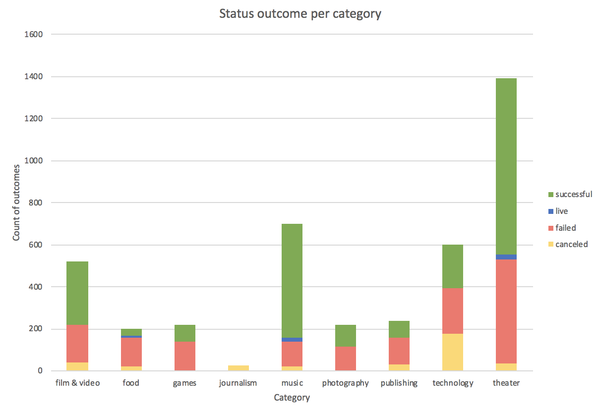
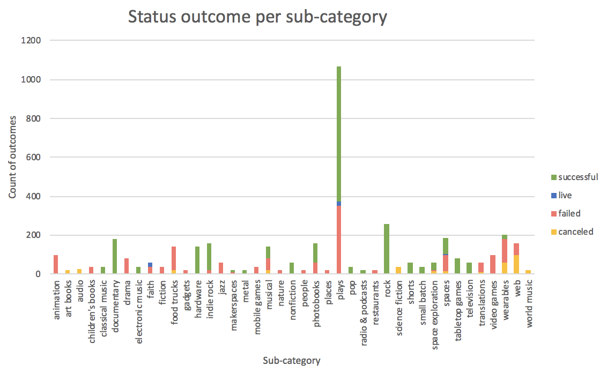
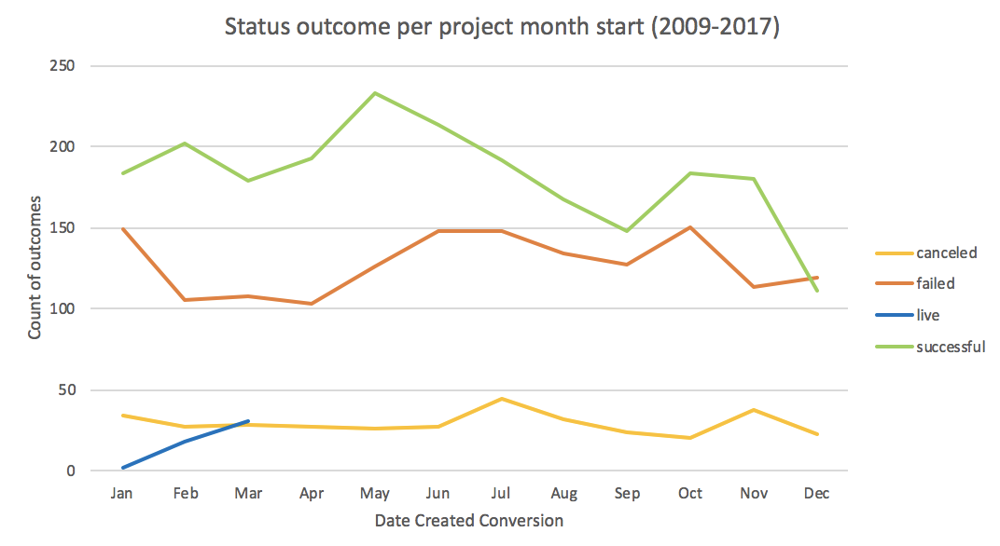
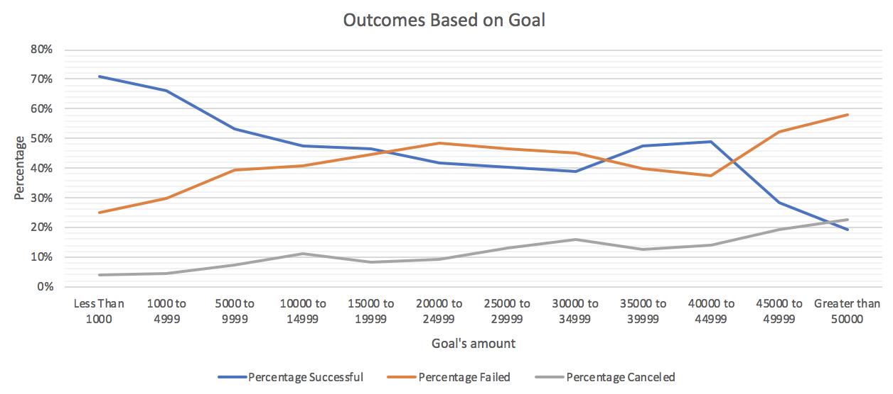

## Crowdfunding Trend Analysis - Kickstarter

# Background 
Over two billion dollars have been raised using the massively successful crowdfunding service, Kickstarter, but not every project has found success. Of the over 300,000 projects launched on Kickstarter, only a third have made it through the funding process with a positive outcome.

Since getting funded on Kickstarter requires meeting or exceeding the project's initial goal, many organizations spend months looking through past projects in an attempt to discover some trick to finding success. For this week's homework, you will organize and analyze a database of four thousand past projects in order to uncover any hidden trends.

# Conclusions 
1. What are three conclusions we can make about Kickstarter campaigns given the provided data?

- Category\
Entertainment (music, theater, film & videos) projects are the most successful both by volume and percentage. In particular, successful music projects outnumber failed ones by more than 3:1. Technology projects are the least likely to succeed with only 1/3 being successful and 2/3 either failed or cancelled. \
\

- Sub-category  
The plays sub-category has by far the most number of projects. It is also quite successful with roughly 60% successful. Although less popular, rock, documentary and hardware projects have always been successful. On the negative side for projects with more than 100 outcomes, the sub-categories of animation, food trucks, video games and web always seem to fail.\
\

- Monthly status  
From 2009 to 2017, projects started in May had the best chance of a successful outcome. February and April were also statistically successful months to start a project. From May to Sept, the success rate gradually declined. December was by far the least successful month being the only month with more failures than successes. 
\

2. What are some of the limitations of this dataset? 
- Certain categories, such as technology projects, may have a much higher funding goal than projects that require less capital investment (e.g. plays). 
- There is no data regarding who funded projects. For example, entertainment projects could all have been funded by the same rich investors and that is why they are usually more successful than other project categories.
- Some projects, such as web or technology, may need to be competitively globally while others like live theater, plays, ad music don’t. Thus comparing them against each other may not be fair.

3. What are some other possible tables/graphs that we could create?
- Bar chart for category/sub-category comparison by project length. 
- Table for successful projects sorted by how successful they were (% funded). For example, entertainment projects might just be barely successful whereas the few technology projects that did succeed may have been wildly successful.

4. Bonus - Create a line chart which graphs the relationship between a goal's amount and its chances at success, failure, or cancellation  
\

