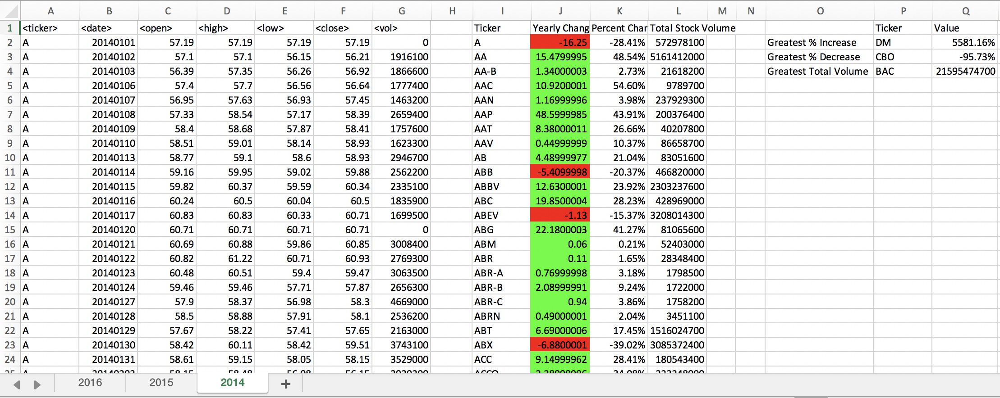
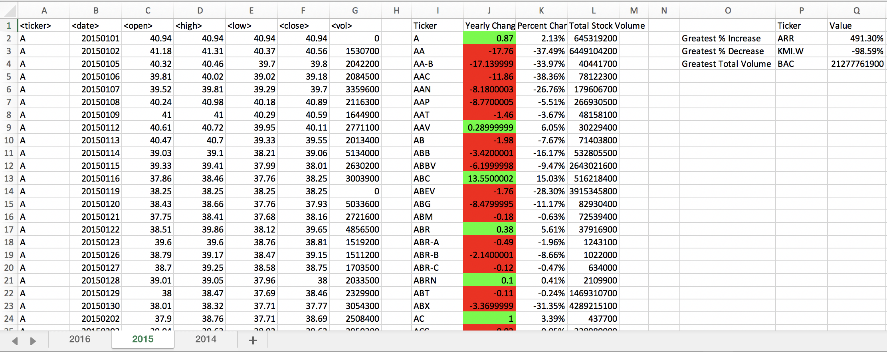
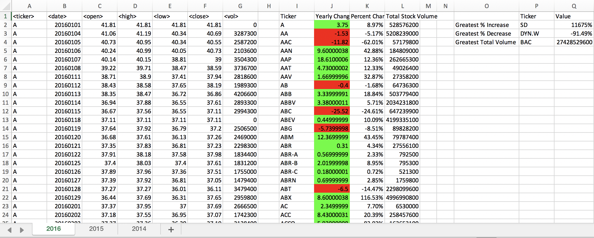

# Stock Market Analysis 

## Background
VBA Scripts for analyzing the stock market from 2014 to 2016.

## Part 1 (Easy)

- Create a script that will loop through each year of stock data and grab the total amount of volume each stock had over the year.
- Display the ticker symbol to coincide with the total volume.

## Part 2 (Moderate)

- Create a script that will loop through all the stocks and take the following info.
  * Yearly change from what the stock opened the year at to what the closing price was.
  * The percent change from the what it opened the year at to what it closed.
  * The total Volume of the stock.
  * Ticker symbol

- Add conditional formatting that will highlight positive change in green and negative change in red.

## Part 3 (Hard)

- Include everything from the moderate challenge.
- Locate the stock with the "Greatest % increase", "Greatest % Decrease" and "Greatest total volume".

2014 Stock Market Analysis Screenshot

2015 Stock Market Analysis Screenshot

2016 Stock Market Analysis Screenshot

