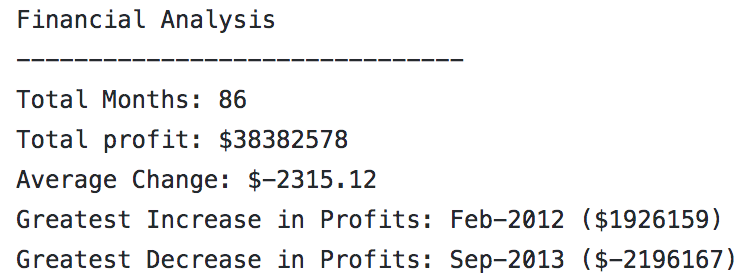
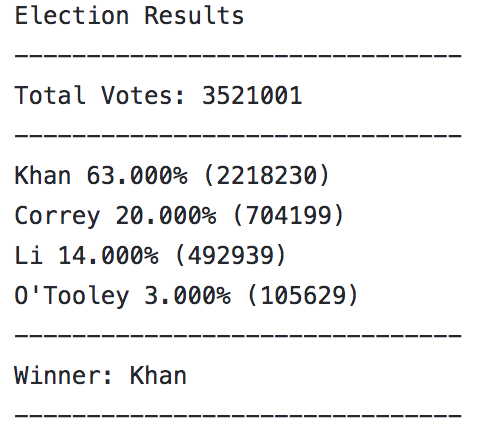

# Python-Challenge
Python script for analyzing the financial records of a company. Utilize a set of financial data called budget_data.csv. The dataset is composed of two columns: Date and Profit/Losses. 

## PyBank
- Python script that analyzes the records to calculate each of the following:
  * The total number of months included in the dataset
  * The net total amount of "Profit/Losses" over the entire period
  * The average of the changes in "Profit/Losses" over the entire period
  * The greatest increase in profits (date and amount) over the entire period
  * The greatest decrease in losses (date and amount) over the entire period
- In addition, the final script both print the analysis to the terminal and export a text file with the results.

### PyBank Result Screenshot

## PyPoll
- Python Script to help a small, rural town modernize its vote-counting process. Utilize a set of poll data called election_data.csv. The dataset is composed of three columns: Voter ID, County, and Candidate. 
- Python script that analyzes the votes and calculates each of the following:
  * The total number of votes cast
  * A complete list of candidates who received votes
  * The percentage of votes each candidate won
  * The total number of votes each candidate won
  * The winner of the election based on popular vote.
- In addition, the final script both print the analysis to the terminal and export a text file with the results.\

### PyPoll Result Screenshot

