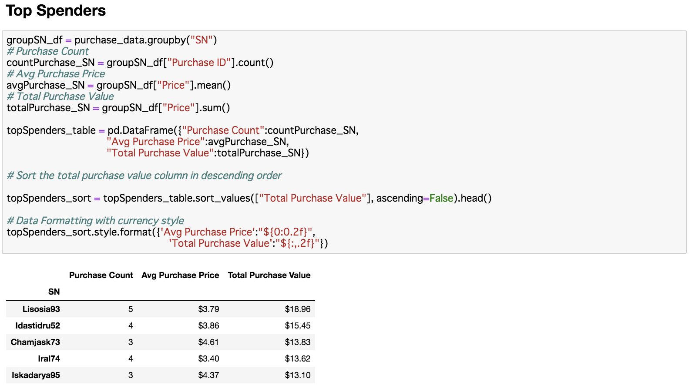

# Data Analysis - The game company, Pymoli

## Background 
As Lead Analyst for an independent gaming company, I've been assigned the task of analyzing the data for their most recent fantasy game Heroes of Pymoli. 
Like many others in its genre, the game is free-to-play, but players are encouraged to purchase optional items that enhance their playing experience. As a first task, the company would like me to generate a report that breaks down the game's purchasing data into meaningful insights.
 
## Three Observable trends based on the data
1. Gender 
  A 84% majority of players are male with just 14% female. Even though there's far fewer female player, their average spend is actually ~10% higher than for males. 
   
1. Age Demographics 
  Outside from the two main age demographics of 15-19 and 20-24, the other age groups still spend about the same on average. In fact, the two highest spending groups are actually 30-34 (avg total  4.76)𝑎𝑛𝑑<10(𝑎𝑣𝑔𝑡𝑜𝑡𝑎𝑙  4.54). 
   
1. Items 
  Purchases are evenly spread out among many people. The top spender only purchased 5 items(total $ 18). Also, for items, the most popular item was purchased only 12 times. 4/5 most people items are also the most profitable. 
   

 
 
 
 
 
 
 
 
 
 

