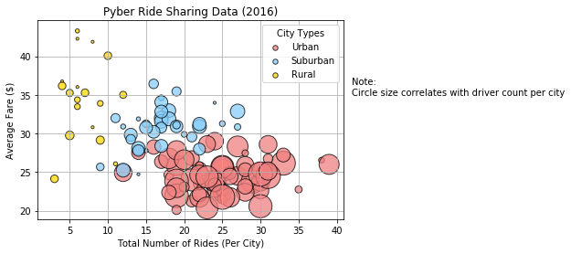
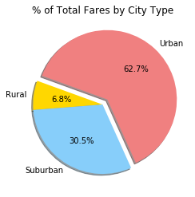
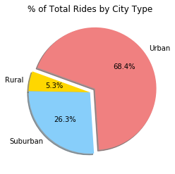
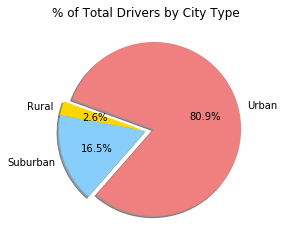
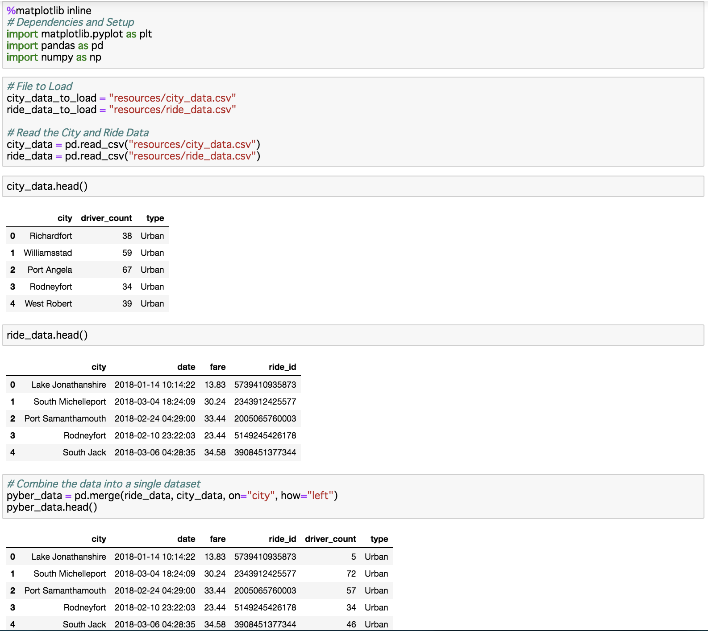

# Data Analysis - The ride sharing company, Pyber

## Background
The ride sharing bonanza continues! Seeing the success of notable players like Uber and Lyft, you've decided to join a fledgling ride sharing company of your own. In your latest capacity, you'll be acting as Chief Data Strategist for the company. In this role, you'll be expected to offer data-backed guidance on new opportunities for market differentiation.\
\
You've since been given access to the company's complete recordset of rides. This contains information about every active driver and historic ride, including details like city, driver count, individual fares, and city type.

## Observable trends based on the data
1. Urban cities have the lowest average fare with the highest number of rides. On the other hand, rural cities's result is the opoosite.

2. Even though rural drivers are only 2.6% of total drivers, they got 6.8% of total fares. Thus each rural driver earned more on average.

3. % of total rides by city type relates to the total fare for all 3 types. That means if pyber increases the number of rural drivers then they should increase total fares.\
From the above results, it can be concluded that there should be more rural drivers.

### Final Visualization Screenshots
\
\
\

<!--
\
\
\
\
\
\
-->

