# Data Analysis - WeatherPy

## Background 
Python script to visualize the weather of 500+ cities across the world of varying distance from the equator. To accomplish this, I will utilize a simple Python library, the OpenWeatherMap API, and a little common sense to create a representative model of weather across world cities.\
\
The visualization has a series of scatter plots to showcase the following relationships: 
  * Temperature (F) vs. Latitude
  * Humidity (%) vs. Latitude
  * Cloudiness (%) vs. Latitude
  * Wind Speed (mph) vs. Latitude\

The scripts acocomplishes the following:
  * Randomly select at least 500 unique (non-repeat) cities based on latitude and longitude.
  * Perform a weather check on each of the cities using a series of successive API calls.
  * Include a print log of each city as it's being processed with the city number and city name.
  * Save both a CSV of all data retrieved and png images for each scatter plot. 

## Three observable trends based on the data
  * Not surprisingly, temperate increases as you get closer to the equator. However, the temperate peaks at around 20 degrees latitude and not at the equator.
  * Cloudiness and humdity don't show strong correltions to latitude. However, it looks like humidity decreases the most at 2 separate troughs, 20 degrees latitude and -20 degrees.
  * Wind speed appears to increase slightly the further away you go from the equator. For a definitive conclusion, I would need to make another variable to analyze it.\
 \
  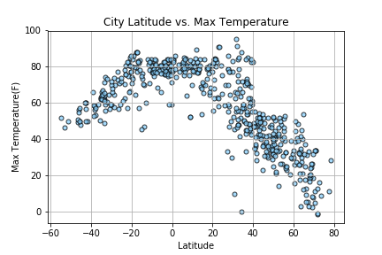 
  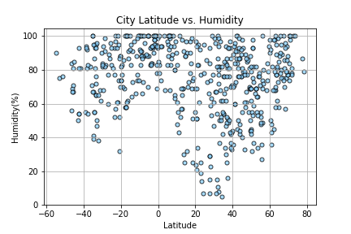 
  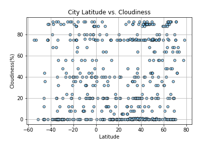 
  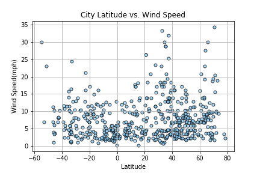 

### Python codes 
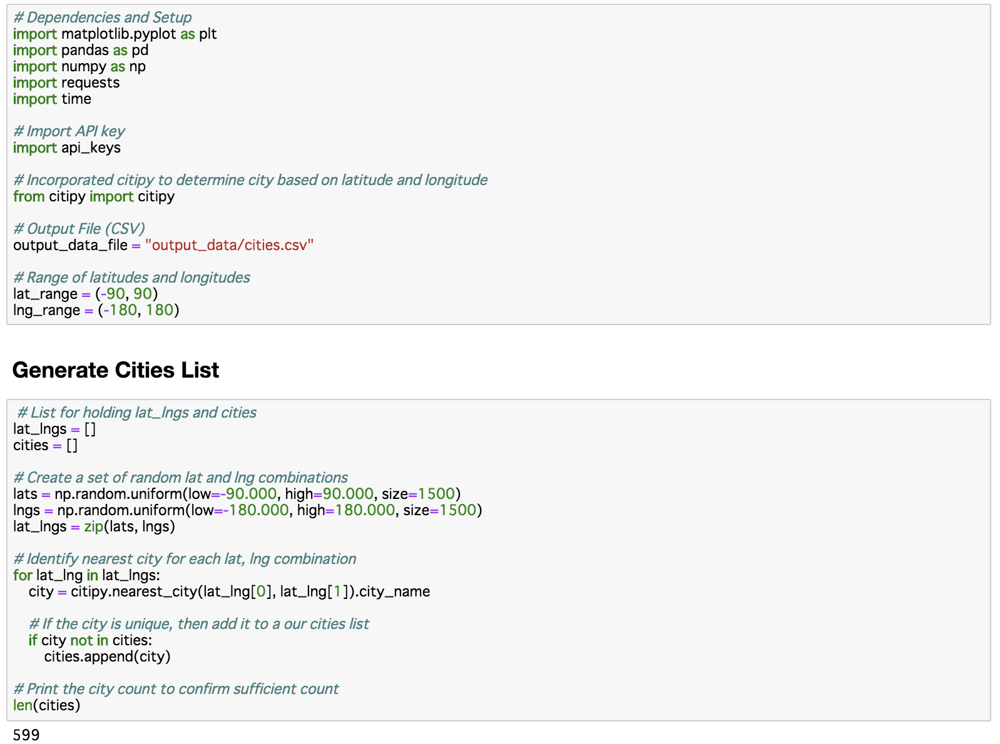\
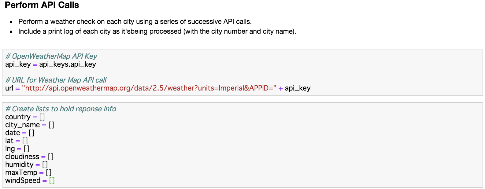\
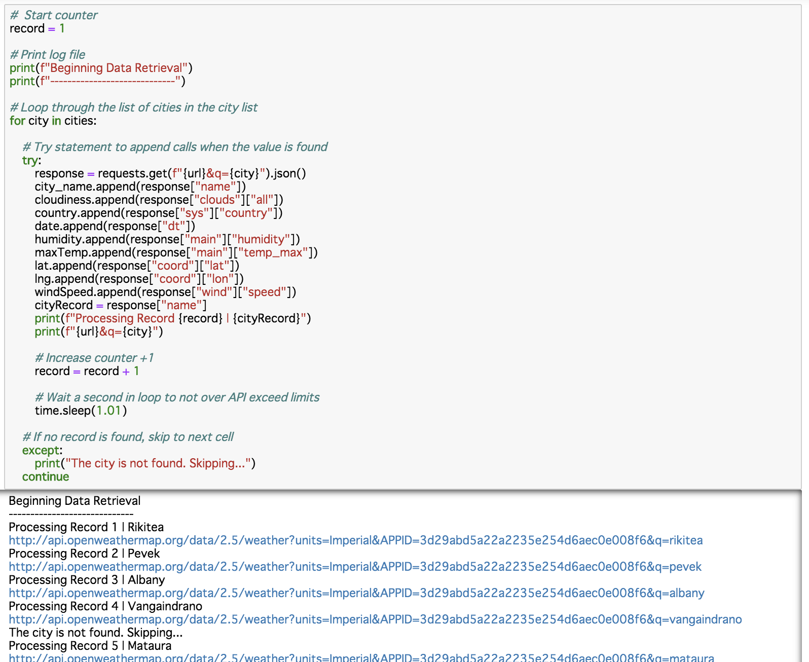\
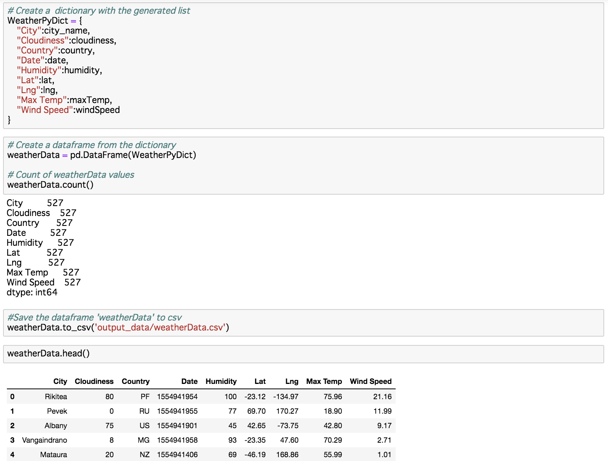\
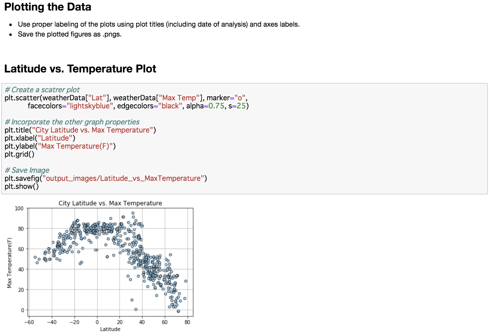\
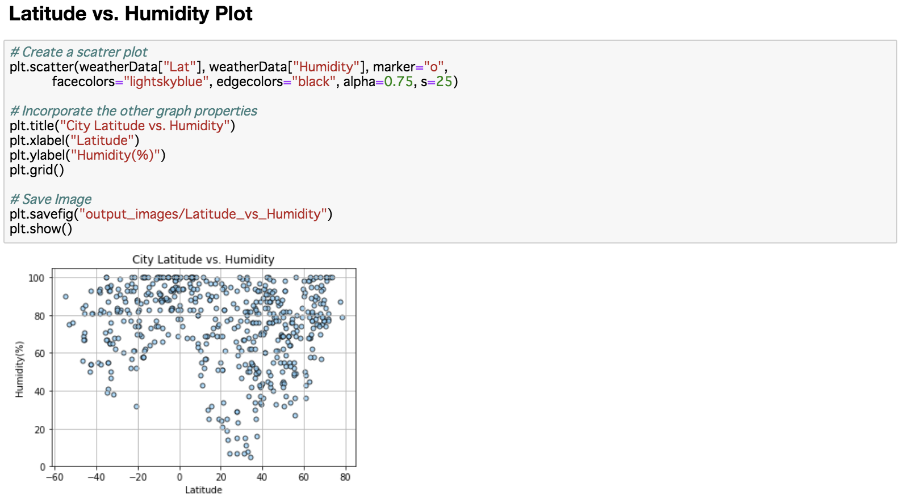\
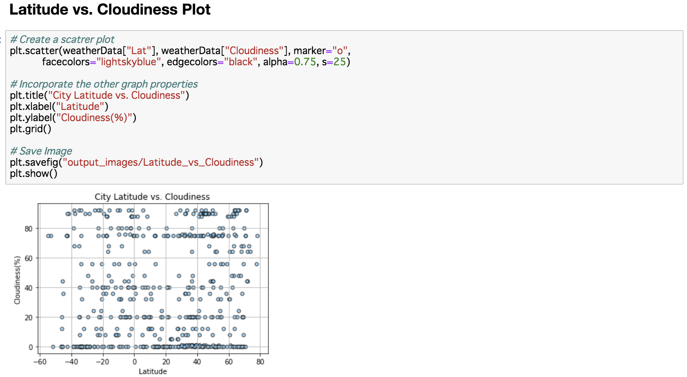\
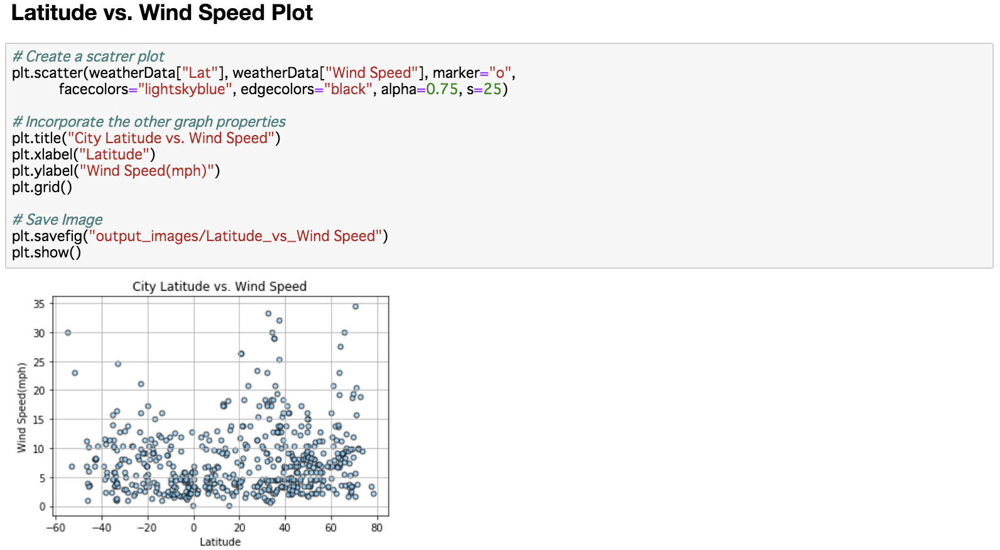
