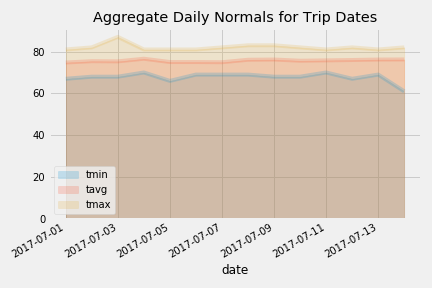
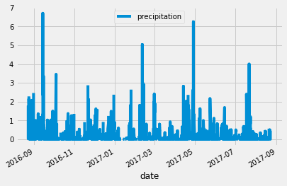
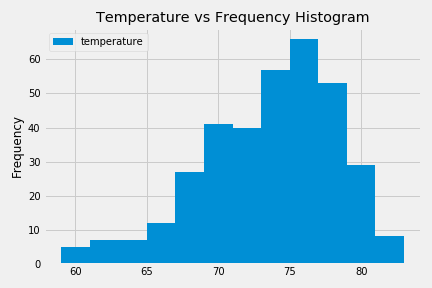
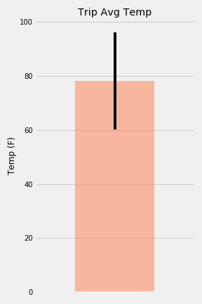

# Climate Analysis 

## Background 
**Step 1** - Climate Analysis and Exploration
To begin, use Python and SQLAlchemy to do basic climate analysis and data exploration of your climate database. All of the following analysis should be completed using SQLAlchemy ORM queries, Pandas, and Matplotlib.
  * Precipitation Analysis
  * Station Analysis  
 

**Step 2** - Climate App
Design a Flask API based on the queries that is just developed.
 

**Optional** - Other Recommended Analyses
  * Temperature Analysis
  * Daily Rainfall Average\
  
\
\
\
\

<!--
 
 
 
 
 
 
 
 
 
 
 
-->