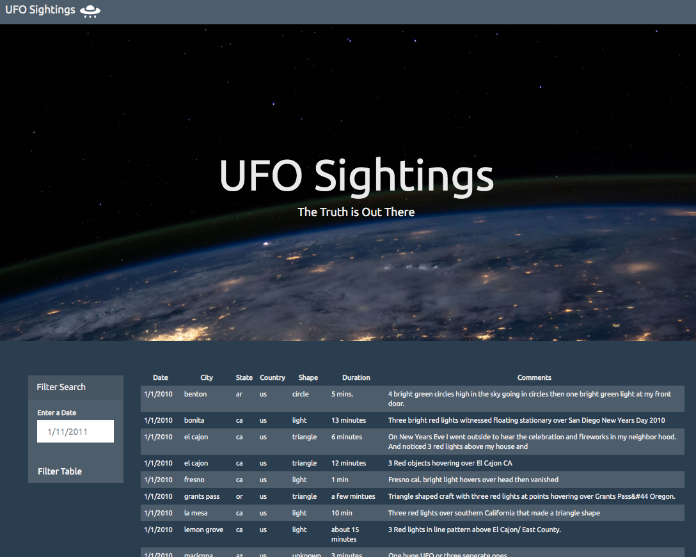
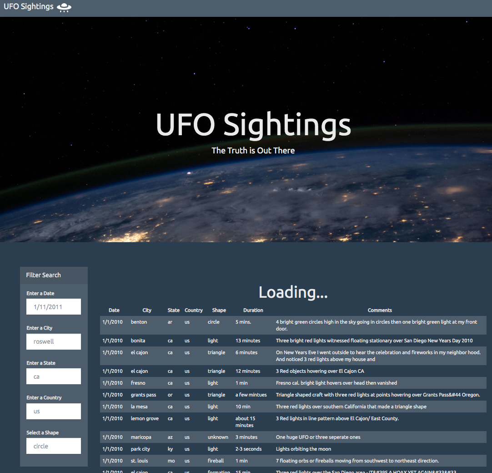

# JavaScript - UFO sighting
The website that creates a table dynamically based upon a dataset that are created. It allows the users to filter the table data for specific values. I only Javascript, HTML, CSS and D3.js on the web pages. 

## Level 1: Automatic Table and Date Search
  * Basic HTML web page using the UFO dataset provided in the form of an array of JavaScript objects. 
  * Appends a table to the web page and then adds new rows of data for each UFO sighting.

## Level 2: Multiple Search Categories
  * Multiple input tags and/or select dropdowns.
  * The user can set multiple filters and search for UFO sightings using the following criteria based on the table columns:
  1. date/time
  1. city
  1. state
  1. country
  1. shape

