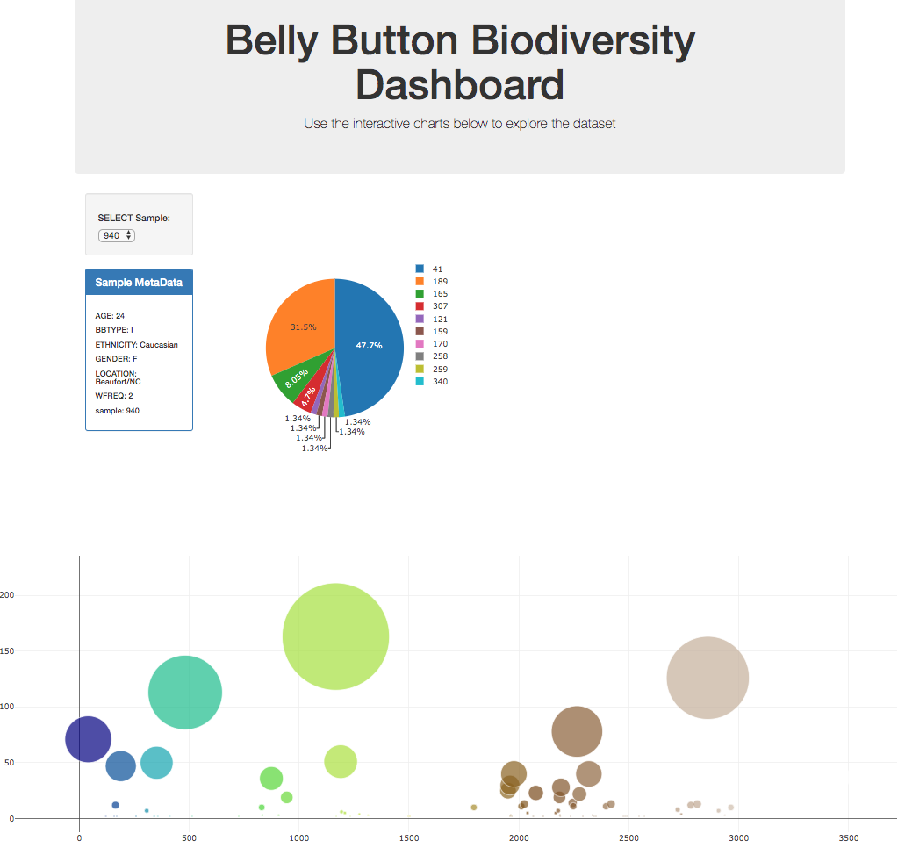

# Interactive Dashboard - Plotly

- Used Plotly.js to build interactive charts for the dashboard. 
  * Pie chart that uses data from my sample route to display the top 10 samples. 
  * Bubble chart that uses data from my samples route to display each sample.

- Used Flask API to serve the data need for the plots.

