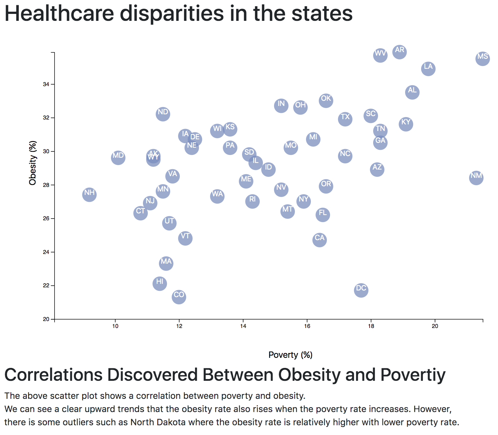

# Obesity vs. Povertiy Scatter Plot Visualization - D3.js
Interactive scatter plots to show the correlations discovered between Obesity and Povertiy by states. 

## Dataset
  * U.S. Census Bureau and the Behavioral Risk Factor Surveillance System.

  * The data set included with the assignment is based on 2014 ACS 1-year estimates: https://factfinder.census.gov/faces/nav/jsf/pages/searchresults.xhtml. The current data set incldes data on rates of income, obesity, poverty, etc. by state. MOE stands for "margin of error."

### Notes
  * D3-tooltip: Able to hover to reveal a specific element's data. 
  * Use python -m http.server to run the visualization. This will host the page at localhost:8000 in the web browser.  
 

