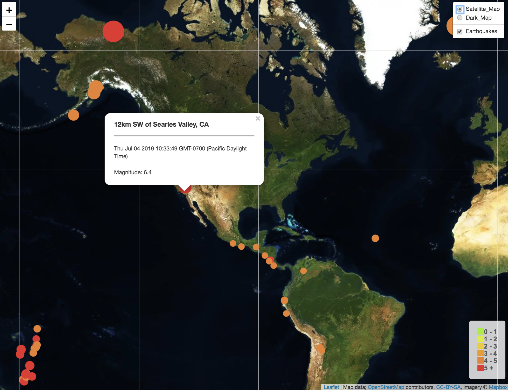
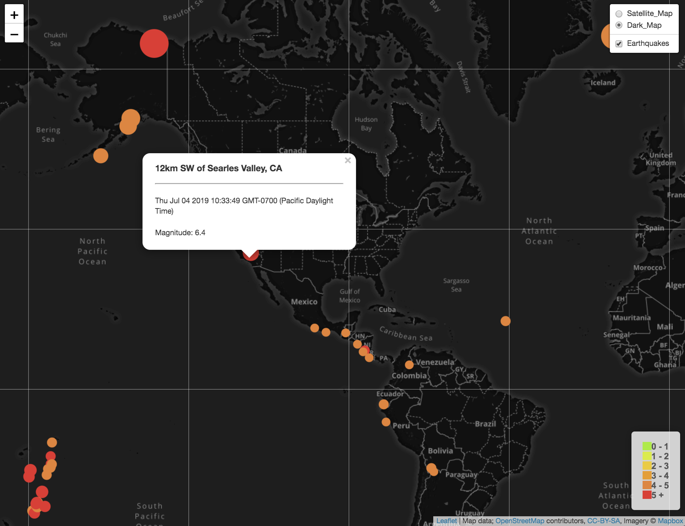

# USGS Earthquakes Mapping Web Visualization - Leaflet JS

## Background
The USGS (the United States Geological Survey) is responsible for providing scientific data about natural hazards, the health of our ecosystems and environment; and the impacts of climate and land-use change.\
The USGS is interested in building a new set of tools that will allow them visualize their earthquake data. They collect a massive amount of data from all over the world each day, but they lack a meaningful way of displaying it. Their hope is that being able to visualize their data will allow them to better educate the public and other government organizations (and hopefully secure more funding..) on issues facing our planet.

### Notes 
1. Get the dataset\
The USGS provides earthquake data in a number of different formats, updated every 5 minutes. Visit the USGS GeoJSON Feed page(https://earthquake.usgs.gov/earthquakes/feed/v1.0/geojson.php) and pick a data set to visualize.
1. Import & Visualize the Data\
A map using Leaflet that plots all of the earthquakes from the dataset based on their longitude and latitude. 

### Final Visualization Screenshots
Earthquake Map - Satellite

Earthquake Map - Dark
