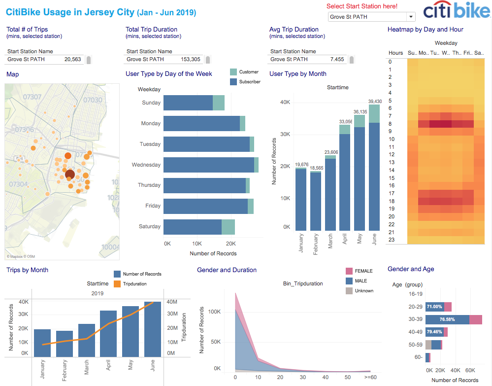
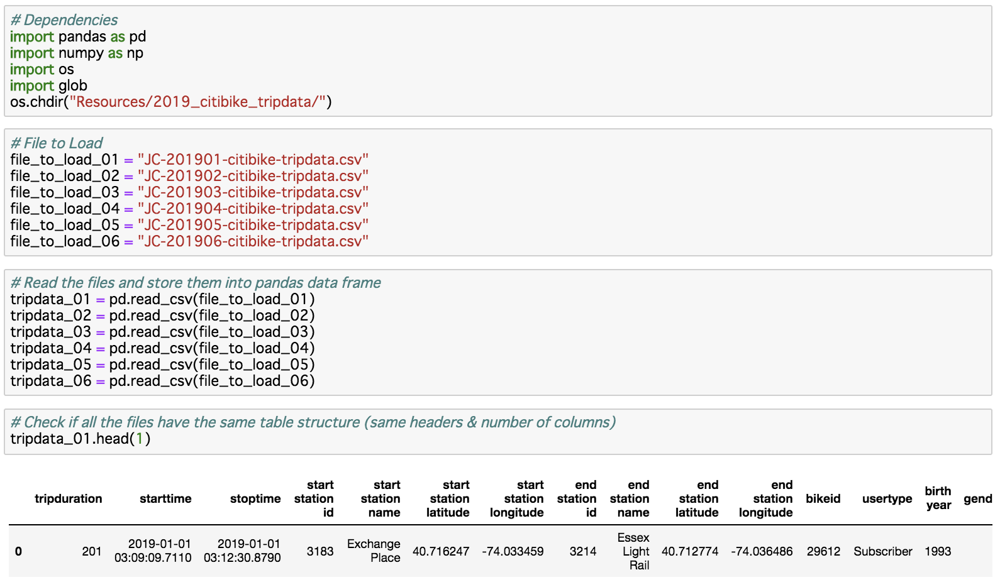
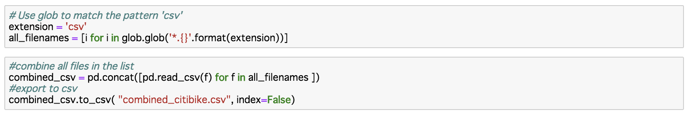

# Citi Bike Analytics - Tableau 

## Background
Since 2013, the Citi Bike Program has implemented a robust infrastructure for collecting data on the program's utilization. 
Aggregated the data found in the Citi Bike Trip History Logs to build a data dashboard by Tableau.

## Dataset
Citi Bike Data webpage(https://www.citibikenyc.com/system-data)　

### Final Visualization Screenshot - CitiBike Data 

### Python - Merge CSV files

